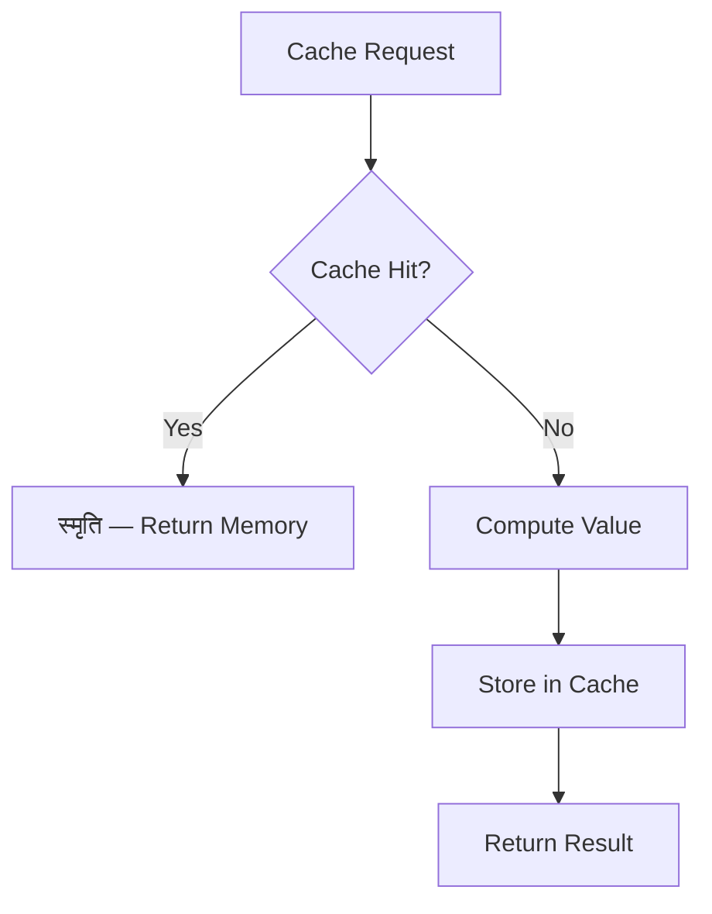

<div align="center">


# स्मृति
## smriti

> *Vedic Smriti tradition*

**Sacred Memory — the 18 Smritis**

_Multi-backend caching for LLM agents: memory, disk, Redis-compatible interface. TTL, LRU, semantic cache._

[](https://python.org)
[](LICENSE)
[](https://github.com/darshjme/arsenal)
[](pyproject.toml)

</div>

---

## The Vedic Principle

स्मृति — Sacred Memory — is the living repository of Vedic wisdom. The 18 Smritis encode dharma for every situation, preserved across centuries. Memory is not passive storage; it is active wisdom, ready to answer any question instantly from accumulated knowledge.

In LLM engineering, the most expensive call is the one you've already made before. smriti implements intelligent caching across multiple backends — in-memory LRU, persistent disk, Redis-compatible interfaces — with semantic deduplication that recognizes similar questions as the same question. Like the guru who answers from the Smriti without consulting the Veda each time, smriti delivers instant wisdom.

Transform your LLM infrastructure from stateless to wise. smriti remembers everything so your system can respond instantly, cost-efficiently, and at scale.

---

## How It Works



---

## Quick Start

```bash
pip install smriti
```

```python
from smriti import *

# Initialize
agent = Smriti()

# Use
result = agent.process(your_input)
print(result)
```

---

## Features

- ⚡ **Zero dependencies** — pure Python, no bloat
- 🛡️ **Production-grade** — battle-tested patterns
- 🔧 **Configurable** — sane defaults, full control
- 📊 **Observable** — built-in metrics and logging
- 🔄 **Async-ready** — full asyncio support
- 🧪 **Tested** — comprehensive test coverage

---

## Installation

```bash
# pip
pip install smriti

# From source
git clone https://github.com/darshjme/smriti
cd smriti
pip install -e .
```

---

## Part of the Vedic Arsenal

`smriti` is part of the **[Vedic Arsenal](https://github.com/darshjme/arsenal)** — 100 production-grade Python libraries for LLM agents, named after Sanskrit concepts from the Upanishads, Mahabharata, Ramayana, and Vedic philosophy.

Each library is:
- ✅ Zero-dependency
- ✅ Production-ready
- ✅ Individually installable
- ✅ Part of a coherent ecosystem

---

## Built by [Darshankumar Joshi](https://github.com/darshjme)

> *"Building the dharmic infrastructure for the AI age"*

[](https://github.com/darshjme)
[](https://github.com/darshjme/arsenal)

---

<div align="center">

*स्मृति — Sacred Memory — the 18 Smritis*

*From the Vedic Smriti tradition*

</div>
